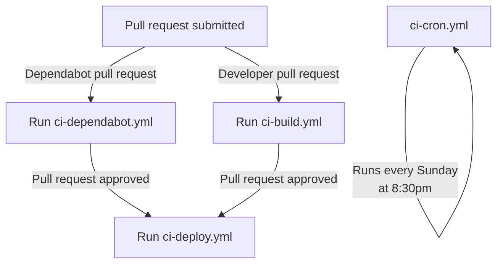
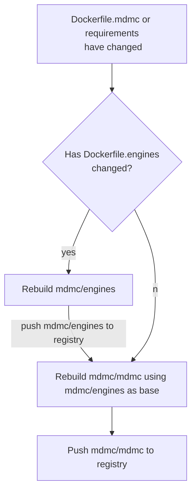

# Github

## Github Actions structure
Our Github Actions continuous integration has the following structure:

where each file does the following:

- `ci-build.yml` contains the scripts for each pull request. This involves testing and profiling the source code and documentation for a pull request. It also builds new containers if necessary.
- `ci-dependabot.yml` is an alternate version of `ci-build.yml`, but with minimal use of secrets. This is because Dependabot does not have access to repository secrets.
- `ci-cron.yml` is our weekly full test build - as well as testing the source code, it tests how well parts of it run outside of a container, how well it runs in a Singularity container, if it is installable on Windows, and whether it runs with MPI (At time of writing, this MPI test is not running as it causes 6-hour hangups somewhere. See issue #761). It also sends a pull request to MDMCproject/MDMCproject.github.io with updated documentation, to be merged manually when desired.
- `ci-deploy.yml` deploys CI-created objects that we want to associate with the master branch; for example, our master branch Docker image `mdmc/mdmc:latest`, or our master branch profiling information.

## Container Deployment
If a Github branch makes changes that would require the container to be rebuilt, the container is rebuilt in the CI script `ci-build.yml` (either just `mdmc/mdmc` is rebuilt, or both are rebuilt if changes are made to `Dockerfile.engines`) and then testing is done on the new container. These rebuilt images are pushed to the tag `mdmc/mdmc:BRANCH`, where `BRANCH` is the name of the Git development branch. Then, when the pull request on that development branch is merged, the main Docker images `mdmc/mdmc:latest` and `mdmc/engines:latest` (if necessary) are updated to be the images from that development branch. 

This rebuilding is done via the `build_container.sh` script, which works like so:

## Self-hosted runners
While MDMC is private, we are using self-hosted Github Actions runners (note to future developers - if MDMC is currently public and you are reading this, please change back to Github-hosted ones and remove this section). The repository MDMCproject/github-actions holds information and Ansible playbooks on how to configure and run these.
