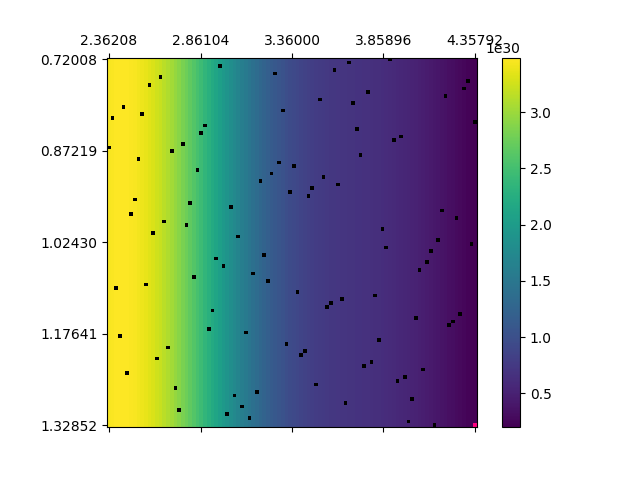
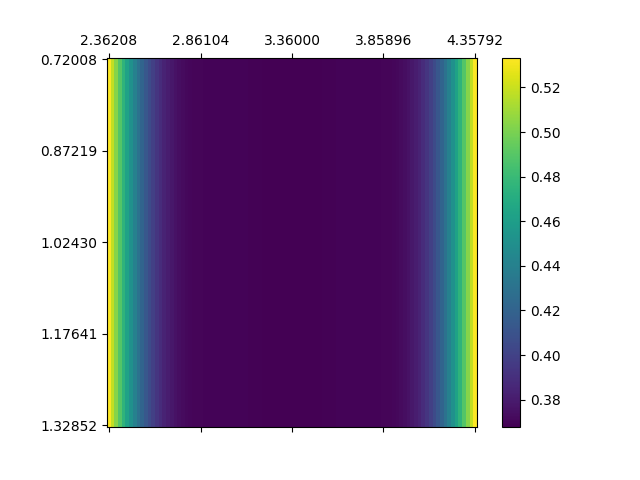
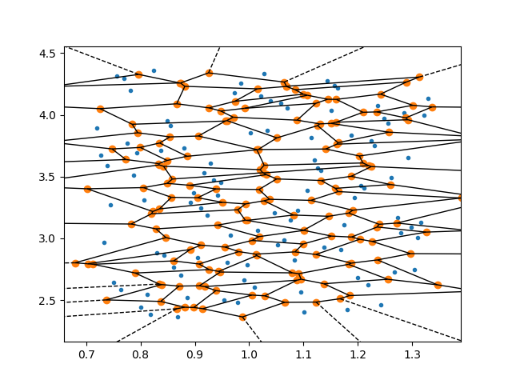

Visualising a GPR fit
=====================

Visualising a GPR fit
---------------------

The ``GPR`` class includes a function, ``plot_results``. This allows you to visualise the
estimated figure of merit within the parameter bounds for systems with 2 parameters.
``plot_results`` should be called within ``extract_result``, as it requires the fitted GPR object as well as the minimum predicted parameters.

``plot_results`` will create a file called ``prediction.png``. This shows the estimated FoM across parameter values, with black points denoting points sampled during refinement and the pink point showing the minimum of the fit.

If ``plot_stddev`` is ``True``, the function will also create ``prediction_std.png``, which shows the standard deviation of predictions as returned by 
`predict <https://scikit-learn.org/stable/modules/generated/sklearn.gaussian_process.GaussianProcessRegressor.html#sklearn.gaussian_process.GaussianProcessRegressor.predict>`_.

Finally, if ``plot_voronoi`` is ``True`` the function will create ``voronoi.png``, 
which creates a `Voronoi diagram <https://en.wikipedia.org/wiki/Voronoi_diagram>`_ to
show how well the sampled points cover the parameter space.

